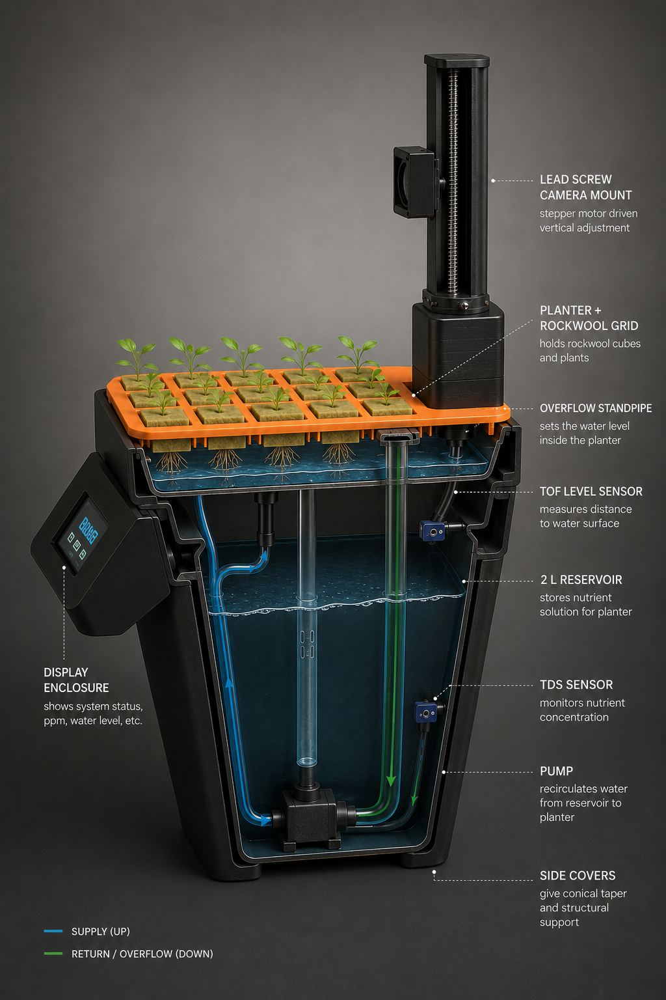

# HerbAI 🌱

**An AI-guided countertop farm that grows food with up to 90% less water.**

Water-smart food production, made simple enough for anyone to grow — and the first of
many turnkey, AI-enabled hydroponic systems.

> Built for **Build for Good — National Student Hackathon for Social Impact**
> Theme: **DHARTI** (Climate, Environment & Ecological Resilience) · Water scarcity

🔗 **Live UI demo:** _enable GitHub Pages (see below), then link `https://<your-user>.github.io/HerbAI/`_
🎬 **Prototype video:** _add your unlisted YouTube link_
📊 **Pitch deck:** _add your Google Slides link_

---

## The problem

India holds **4% of the world's freshwater but 18% of its people**. Roughly
**600 million Indians** already face high-to-extreme water stress, and by **2030** demand
is projected to be **twice the available supply** — with 21 major cities, Bengaluru among
them, on track to exhaust their groundwater _(NITI Aayog, Composite Water Management Index)_.

Most of that water doesn't go to taps — it goes to **growing food**. Closed-loop
hydroponics can grow the same crop on **up to 90% less water**, but adoption stalls because
it is technical, unforgiving, and manual.

## What HerbAI does

HerbAI removes that barrier. The user does just two things — **fill the tank** and
**follow the screen** — while the device handles sensing, dosing, and a recirculating
closed loop that wastes almost nothing.



## How it works

| Step | What happens |
|------|--------------|
| 1. Fill & sense | Add water. ToF + TDS sensors confirm the system is ready. |
| 2. Pick a crop | Choose from a simple menu — mint, basil, coriander, oregano, spring onion. |
| 3. Guided dosing | The screen walks you through nutrients **live**, with colour cues, as it reads the water. |
| 4. Stage-by-stage | It nudges you when to feed as the crop moves through each growth stage. |
| 5. Harvest | Fresh herbs at your counter — grown on a fraction of the water. |

Every step teaches the **why**, so people understand water and nutrients instead of
following blindly.

## The water-smart engine

- **Closed recirculating loop** — a pump lifts nutrient solution from a 2 L reservoir up to
  the planter; an overflow standpipe sets the water level and returns the excess. Nothing runs off.
- **Sensor fusion** — a **ToF** level sensor and a **TDS** concentration sensor together
  estimate what the plant actually drinks (`dissolved mass ≈ level × concentration`), so the
  system distinguishes evaporation from uptake, tops up only what's needed, and never overdoses.
- **Self-correcting** — a stepper-driven camera images the canopy to catch early stress
  (yellowing, curling) and learn a nutrient *recipe* per crop that improves batch after batch.

See [`docs/ARCHITECTURE.md`](docs/ARCHITECTURE.md) and [`docs/HARDWARE.md`](docs/HARDWARE.md).

## Status

✅ **Working prototype** — Raspberry Pi brain, touchscreen guidance UI, live water sensing
(TDS + ToF), recirculating pump, and a motorised inspection camera, all built from low-cost,
off-the-shelf parts and hidden inside a vase form factor.

This repository contains the **firmware skeleton**, the **per-crop nutrient recipes**, the
**interactive UI demo**, and the hardware/architecture docs. Hardware-I/O modules are marked
with `TODO` where they bind to your specific sensor/driver libraries.

## Repository layout

```
HerbAI/
├── index.html              # Interactive UI demo (GitHub Pages → Demo URL)
├── firmware/
│   └── herbai/
│       ├── main.py         # entry point — runs the guided state machine
│       ├── state_machine.py# BOOT → WAIT_WATER → SELECT_CROP → DOSING → GROWING → HEALTH
│       ├── recipes.py      # per-crop EC/ppm targets by growth stage
│       ├── config.py       # pins, reservoir volume, thresholds
│       ├── sensors/        # tds.py, tof.py
│       ├── actuators/      # pump.py, stepper.py
│       └── ui/             # screens.py (TFT rendering)
├── ml/                     # plant-health model + recipe-learning notes
├── docs/                   # architecture, hardware (BOM), images
├── requirements.txt
└── LICENSE
```

## Run the UI demo locally

No build step — it's a single static file.

```bash
# from the repo root
python3 -m http.server 8000
# open http://localhost:8000
```

## Publish the demo (GitHub Pages)

1. Push this repo to GitHub.
2. **Settings → Pages → Source: `main` / `(root)` → Save.**
3. Your demo goes live at `https://<your-user>.github.io/HerbAI/` — paste that as the **Demo URL**.

## Roadmap

- **V1 — Counter (built):** herbs & greens for a household.
- **V2 — Family unit:** balcony-scale greens.
- **V3 — Community pods:** peri-urban micro-farms anyone can run.
- **Shared recipe cloud:** every device's learning improves all of them.

## Impact (DHARTI)

Water resilience · sustainable income from land · learning by growing. HerbAI won't solve
the water crisis alone — it's an **on-ramp and a platform**, starting one counter at a time.

## License

MIT — see [`LICENSE`](LICENSE).
